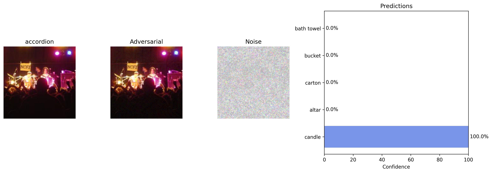

# Jailbreaking Deep Models — Adversarial Attacks on ResNet-34

## 📘 Overview

This project implements and analyzes adversarial attacks on a pretrained **ResNet-34** model trained on **ImageNet-1K**. We evaluate the model’s robustness to different perturbation methods by generating adversarial test sets and measuring top-1 and top-5 accuracy drops. The attacks include:

- **FGSM** (Fast Gradient Sign Method) — pixel-wise single-step
- **PGD** (Projected Gradient Descent) — pixel-wise multi-step
- **Patch-based PGD** — spatially localized attacks
- **Transferability evaluation** — testing adversarial examples on other models (e.g., DenseNet-121)

---

## 📁 Dataset

- Dataset directory: `./TestDataSet/`
- Contains 500 samples from 100 ImageNet classes
- `labels_list.json` provides mapping from class indices to human-readable labels
- Preprocessing uses standard ImageNet normalization:
  ```python
  mean = [0.485, 0.456, 0.406]
  std = [0.229, 0.224, 0.225]
  ```
---

## ✅ Tasks Implemented

### 🔹 Task 1: Baseline Evaluation

* Evaluated ResNet-34 on clean test set
* Reported top-1 and top-5 accuracies

### 🔹 Task 2: FGSM Attack (ε = 0.02)

* Applied untargeted FGSM to generate **Adversarial Test Set 1**
* Visualized perturbed vs. original images
* Measured drop in top-1 and top-5 accuracies

### 🔹 Task 3: PGD Attack (ε = 0.02, α = 0.005, 140 steps)

* Multiple-step gradient attack (PGD) for stronger perturbations
* Generated **Adversarial Test Set 2**
* Achieved ≥70% accuracy drop compared to baseline

### 🔹 Task 4: Patch-Based PGD Attack

* Perturbed only a 32×32 patch within each image
* Allowed ε = 0.5 for patch attacks
* Generated **Adversarial Test Set 3**

### 🔹 Task 5: Transferability to Other Models

* Evaluated DenseNet-121 on all datasets (clean + 3 adversarial)
* Compared performance degradation and discussed transferability

---

## 📊 Results

### 🔸 ResNet-34 Accuracy

| Dataset                       | Top-1 Accuracy | Top-5 Accuracy |
| ----------------------------- | -------------- | -------------- |
| Original Test Set             | 76.00%         | 93.00%         |
| Adversarial Set 1 (FGSM)      | 28.00%         | 60.00%         |
| Adversarial Set 2 (PGD)       | 0.00%          | 6.00%          |
| Adversarial Set 3 (Patch PGD) | 18.00%         | 41.00%         |

* FGSM reduced performance significantly with minimal perturbation.
* PGD completely broke the model under the same budget, with \~100% top-1 degradation.
* Patch-based PGD was less effective due to local constraints, but still caused meaningful drops.

### 🔸 DenseNet-121 Transferability

| Dataset                       | Top-1 Accuracy | Top-5 Accuracy |
| ----------------------------- | -------------- | -------------- |
| Original Test Set             | 75.00%         | 92.00%         |
| Adversarial Set 1 (FGSM)      | 39.00%         | 72.00%         |
| Adversarial Set 2 (PGD)       | 10.00%         | 29.00%         |
| Adversarial Set 3 (Patch PGD) | 22.00%         | 45.00%         |

* Transferability confirms that attacks crafted for ResNet-34 also damage DenseNet-121, though to a lesser extent.
* PGD remains the strongest adversary across models.

---

## 🖼️ Example Visualizations
Due to space constraints in the report, we place the prediction bar‑plots here. More visualisations are inside the [`DL_project_3.ipynb`](DL_project_3.ipynb)  notebook.
These panels illustrate how each attack fools the classifier.

**FGSM (ε = 0.02)**


**PGD (ε = 0.02)**


**Patch‑PGD (ε = 0.5)**


---

### 🔬 Ablation Studies

Ablation studies showed that increasing FGSM’s $\epsilon$ initially causes sharp accuracy drops, but plateaus after 0.01. PGD maintains 0% Top-1 accuracy regardless of step count, while Top-5 degrades gradually with more iterations. Patch-based PGD effectiveness was highly sensitive to step size, restarts, and targeting strategy.

**FGSM Accuracy vs. Epsilon**  
  

**PGD Accuracy vs. Steps**
  

**Patch-Based PGD Hyperparameter Study**

| PGD Steps | Step Size | Restarts | Top-1 Accuracy | Top-5 Accuracy | Target Class |
|-----------|-----------|----------|----------------|----------------|---------------|
| 150       | 0.015     | 8        | 2.80%          | 84.60%         | Untargeted    |
| 100       | 0.01      | -        | 11.20%         | 60.40%         | 5             |
| 100       | 0.05      | 8        | 1.00%          | 44.20%         | 10            |
| 150       | 0.004     | 10       | 0.20%          | 37.20%         | 12            |

---

## 📓 Notebook Files

| Notebook                                         | Purpose                                                                          |
| ------------------------------------------------ | -------------------------------------------------------------------------------- |
| [`DL_project_3.ipynb`](DL_project_3.ipynb)       | End‑to‑end pipeline: data loading, attack generation, evaluation, visualizations |
| [`Patch_ablations.ipynb`](Patch_ablations.ipynb) | **Ablation study** on patch size, ε, and step count variants for Patch‑PGD       |

---

## 🧠 Authors

* Raghu Vamshi Hemadri (rh3884)
* Sai Subhash Kotaru (sk12154)
* Geetha Krishna Guruju (gg3039)

---

## 📎 Citations

* [PyTorch ImageNet Models](https://pytorch.org/vision/stable/models.html)
* Goodfellow et al., “Explaining and Harnessing Adversarial Examples,” 2015.

---

## 💻 Instructions to Run

1. Install dependencies:

   ```bash
   pip install torch torchvision matplotlib numpy tqdm
   ```

2. Download ImageNet-style test images and place them in `./TestDataSet/`.

3. Run the notebook `DL_project_3.ipynb` to generate results.

---
